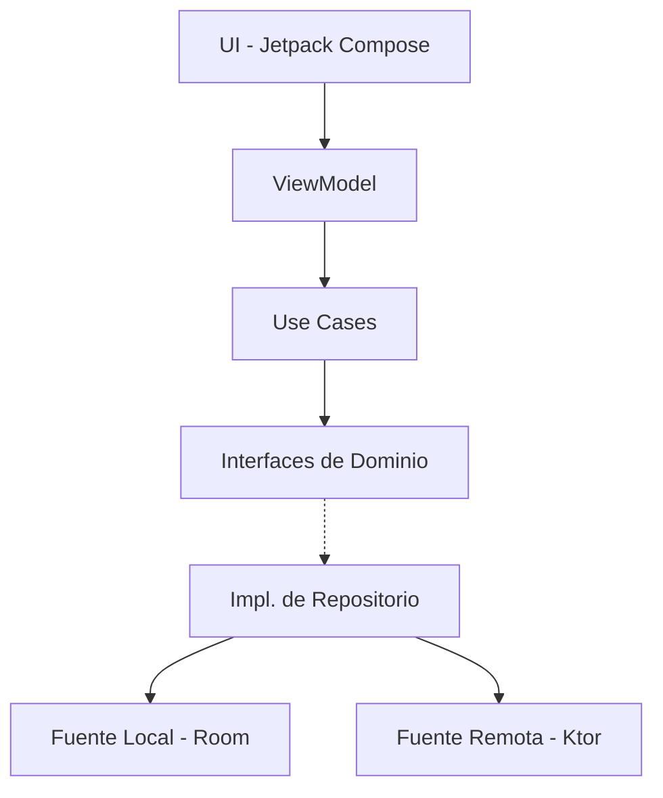

# OneWallet - Gestor de Cartera de inversión

OneWallet es una aplicación Android diseñada para gestionar y realizar el seguimiento de carteras de inversión. Permite a los usuarios monitorizar sus activos (Acciones, Cripto, Fondos, ETFs y Efectivo) en tiempo real, visualizar distribuciones y analizar el rendimiento histórico.

🌐 Idiomas:
- 🇬🇧 [English](README.md)
- 🇪🇸 Español (actual)

## 🚀 Funcionalidades

- **Multi-Activo y Multi-Divisa**: Soporte para acciones de EE. UU., mercados internacionales, criptomonedas, fondos de inversión, ETFs y depósitos bancarios. Los activos pueden añadirse en cualquier divisa y la app calculará y convertirá automáticamente su valor a tu moneda base preferida (EUR o USD) para una vista de cartera unificada.
- **Datos en Tiempo Real**: Integración con múltiples APIs financieras (Finnhub, AlphaVantage, TwelveData, MarketStack) para obtener cotizaciones actualizadas.
- **Analítica Visual**: Gráficos interactivos para la distribución de activos y la evolución mensual de la cartera.
- **Widgets de Pantalla de Inicio**: Mantente al día con el saldo de tu cartera y los precios del mercado directamente en la pantalla de inicio. Los widgets se actualizan automáticamente cada hora mediante **WorkManager** para mantener los datos actualizados sin un consumo excesivo de batería.
- **Caché Inteligente y Límites de API**: Para respetar las limitaciones de las APIs y mejorar el rendimiento, he implementado una capa de caché personalizada. La app determina la "frescura" de los datos para cada tipo de inversión; si los datos en caché están dentro del umbral de tiempo permitido, se reutilizan en lugar de realizar nuevas peticiones API.
- **Privacidad Primero**: Todos los datos se almacenan localmente usando la base de datos Room. Sin sincronización en la nube, sin rastreo.
- **Modo Privacidad (Agitar para Ocultar y Desenfoque)**: Diseñado pensando en la privacidad del usuario. Al agitar el dispositivo, la información sensible como saldos y posiciones se oculta instantáneamente. En Android 12+ (API 31), se aplica un **efecto de desenfoque gaussiano** nativo a las áreas sensibles para una experiencia de privacidad premium.
- **Onboarding Guiado**: Tutorial interactivo dentro de la app que guía a los usuarios a través de cada componente y funcionalidad principal.
- **Edge-to-Edge**: Soporte completo para el dibujo de borde a borde de Android 15+, asegurando que la interfaz fluya sin problemas detrás de las barras del sistema para un aspecto inmersivo.
- **Telemetría Personalizada**: Integración de un sistema de telemetría ligero y privado a través de la **API de Telegram** para el reporte de errores en tiempo real sin necesidad de SDKs de terceros como Firebase o Sentry.
- **Soporte Offline**: Datos en caché y entrada manual de activos para un uso fluido sin internet.
- **Integración Continua (CI)**: Pipeline totalmente automatizada que compila la app y ejecuta toda la suite de tests unitarios en cada push, asegurando la estabilidad y fiabilidad del código.

## 🛠 Stack Tecnológico y Arquitectura

Este proyecto está construido siguiendo los más altos estándares de desarrollo Android, centrándose en la mantenibilidad, testabilidad y rendimiento.

### Arquitectura: Clean Architecture + MVI

El proyecto está estructurado en tres capas para asegurar una clara separación de responsabilidades, siguiendo una regla de dependencia unidireccional:
- **Capa de Dominio**: Lógica de negocio en Kotlin puro, Casos de Uso e interfaces de Repositorios.
- **Capa de Datos**: Implementaciones de repositorios, base de datos Room, clientes de red Ktor y Mappers.
- **Capa de Presentación**: Interfaz de usuario con Jetpack Compose, ViewModels y MVI (Model-View-Intent) para una gestión de estados predecible.



### Librerías y Herramientas
- **UI**: Jetpack Compose (Material 3), **Compose Compiler Reports** para análisis de estabilidad.
- **Inyección de Dependencias**: Koin (Android, WorkManager, Compose).
- **Trabajo Asíncrono**: Kotlin Coroutines & Flow.
- **Red**: Cliente Ktor (motor CIO, Negociación de Contenido, Logging).
- **Serialización**: Kotlinx Serialization.
- **Persistencia**: Base de datos Room (con KSP).
- **Arquitectura**: **Navigation 3** (la última evolución de Jetpack Navigation), ViewModel.
- **Tareas en Segundo Plano**: WorkManager.
- **Onboarding/Tutoriales**: Coachmark (UnifyCoachmark).
- **Animaciones**: Lottie para splash y transiciones.
- **Visuales**: Coil para iconos de activos, Material Icons Extended.
- **Widgets**: Jetpack Glance (soporte para Material 3).
- **Colecciones**: **Kotlinx Immutable Collections** para recomposición optimizada en Compose.
- **Testing**: JUnit 5 (Jupyter), MockK, Turbine (para testing de Flow) y extensiones personalizadas de MainDispatcher.
- **Sistema de Compilación**: Gradle Kotlin DSL, Version Catalog (libs.versions.toml).
- **Desarrollo Asistido por IA**: Archivos de contexto personalizados (`GEMINI.md`, `android-rules.md`) para aprovechar los LLMs para un desarrollo más rápido, consistente y alineado arquitectónicamente.

## 📊 Desafíos y Soluciones de Datos Financieros

Uno de los mayores desafíos en este proyecto fue encontrar fuentes de datos financieros fiables y gratuitas. La mayoría de las APIs profesionales para mercados globales, ETFs y fondos de inversión son costosas o extremadamente restringidas. He implementado una estrategia multi-fuente para asegurar que la app permanezca funcional:

### Estrategia de Fuentes de Datos
- **Criptomonedas**: Integración nativa con la **API de Binance**, que proporciona datos en tiempo real para miles de pares sin necesidad de una clave API.
- **Acciones de EE. UU.**: Datos principales de **Finnhub** (límite: 60 peticiones/min).
- **Mercados Internacionales**: Uso extensivo de **Yahoo Finance** como fuente principal para acciones globales.
- **Fondos de Inversión y ETFs**: Dado que prácticamente no existen APIs gratuitas para estos activos, he implementado soluciones personalizadas:
    - **Intercepción de Backend**: Ingeniería inversa de peticiones web públicas de portales financieros.
    - **Web Scraping**: Mecanismo de fallback que extrae datos de precios directamente de las páginas de detalles de activos cuando las APIs fallan.
- **Sistema de Fallback Inteligente**: La app está diseñada para probar múltiples proveedores secuencialmente si la fuente primaria no encuentra un símbolo específico o alcanza su límite.

### Mitigación de Límites y Escalabilidad
Para eludir las estrictas limitaciones de los niveles gratuitos de las APIs y asegurar que la app funcione para múltiples usuarios se han aplicado las siguientes medidas:
- **Rotación de Claves API**: He integrado múltiples claves API para los mismos proveedores.
- **Distribución Inteligente**: Las claves se distribuyen entre los dispositivos mediante un algoritmo de hash basado en el `ANDROID_ID` único. Esto asegura que la carga total de peticiones se distribuya entre diferentes claves, evitando que un solo usuario agote la cuota global para los demás.
- **Caché Local**: Uso extensivo de la base de datos Room para cachear precios y reducir peticiones de red innecesarias.

## 🏗 Estructura del Proyecto

```text
com.davidcrespo.onewallet
├── core             # Composables comunes, extensiones y modelos base
├── data             # Clientes de red, configuración de BD e implementaciones de Repositorios
├── di               # Módulos de inyección de dependencias Koin
├── domain           # Lógica de negocio: Casos de Uso, interfaces de Repositorio y modelos de dominio
└── presentation     # Capa de UI: Pantallas, ViewModels, Contratos MVI y Sistema de Diseño
```

## ⚙️ Configuración y Claves API

El proyecto requiere varias claves API para obtener datos financieros. Estas se gestionan a través de `secrets.properties` en entornos locales y Variables de Envío en CI.

### 1. Configuración Local
Crea un archivo `secrets.properties` en el directorio raíz:
```properties
FINNHUB_API_KEY=tu_clave
ALPHA_VANTAGE_API_KEY=tu_clave
ALPHA_VANTAGE_API_KEY_2=tu_clave
ALPHA_VANTAGE_API_KEY_3=tu_clave
MARKETSTACK_API_KEY=tu_clave
MARKETSTACK_API_KEY_2=tu_clave
TWELVE_DATA_API_KEY=tu_clave
TELEGRAM_API_KEY=clave_opcional
TELEGRAM_CHAT_ID=id_opcional
```

### 2. Proveedores de API
- **Finnhub**: Usado para datos de acciones de EE. UU.
- **TwelveData**: Alternativa para datos de acciones de EE. UU. y Cripto.
- **AlphaVantage**: Fuente principal para acciones internacionales y fondos.
- **MarketStack**: Fuente secundaria para mercados globales.

*Nota: Los niveles gratuitos de estas APIs tienen límites de frecuencia estrictos. La app los gestiona de forma elegante.*

## 🧪 Testing

El proyecto incluye una robusta suite de pruebas:
- **Tests Unitarios**: Cobertura para Casos de Uso y ViewModels usando MockK y Turbine.
- **Tests de Integración**: Verificación del flujo de datos entre capas.
- **Tests de UI**: (En progreso) Tests de humo para componentes de Compose.

Para ejecutar los tests:
```bash
./gradlew test
```

## 📈 Decisiones de Diseño y Estándares Profesionales

- **Patrón MVI**: Elegido para asegurar una única fuente de verdad para el estado de la UI, facilitando la depuración y el testeo de pantallas complejas como la vista de Cartera.
- **Estabilidad y Rendimiento de Compose**: 
    - Uso de **Colecciones Inmutables** para asegurar que los componentes de la UI sean marcados como "Estables" por el compilador de Compose, evitando recomposiciones innecesarias y asegurando un rendimiento de 60fps en dispositivos de gama baja.
    - Implementación de **State Hoisting** para composables más limpios, testeables y reutilizables.
    - Uso estratégico de **remember** y **derivedStateOf** para minimizar cálculos y recomposiciones costosas.
    - Renderizado eficiente de listas usando **claves únicas** en `LazyColumn` y `LazyRow` para optimizar adiciones, eliminaciones y reordenamientos de elementos.
    - Adopción de **Data Classes Inmutables** en toda la capa de presentación para mantener la integridad del estado y la estabilidad del compilador.
    - Auditorías regulares usando **Compose Compiler Reports** para identificar y corregir composables no skippables.
- **Accesibilidad (A11y)**: Cada componente de la UI está diseñado pensando en la accesibilidad, usando semántica adecuada y `contentDescription` para soportar lectores de pantalla.
- **Edge-to-Edge Moderno**: Implementación nativa de los últimos estándares de dibujo de Android, gestionando correctamente los insets de ventana en todas las pantallas.
- **Internacionalización (i18n)**: Soporte completo para inglés y español, con una estructura lista para una fácil localización a más idiomas.
- **Gestión de Errores Resiliente**: Implementación de una robusta estrategia de gestión de errores usando tipos Result personalizados y estados de UI específicos para proporcionar feedback significativo al usuario incluso durante fallos de red complejos o escenarios de limitación de frecuencia.
- **Ktor sobre Retrofit**: Usado por su potencial multiplataforma y una configuración basada en DSL más moderna.
- **Glance para Widgets**: Aprovecha una sintaxis similar a Compose para construir widgets de la app, asegurando la consistencia de la UI en todo el sistema.
- **Activos Manuales vs de Mercado**: El sistema distingue entre activos con precio automático (Acciones/Cripto) y entradas manuales (Banco/Otros), proporcionando un cálculo de saldo unificado a través de un Caso de Uso especializado.
