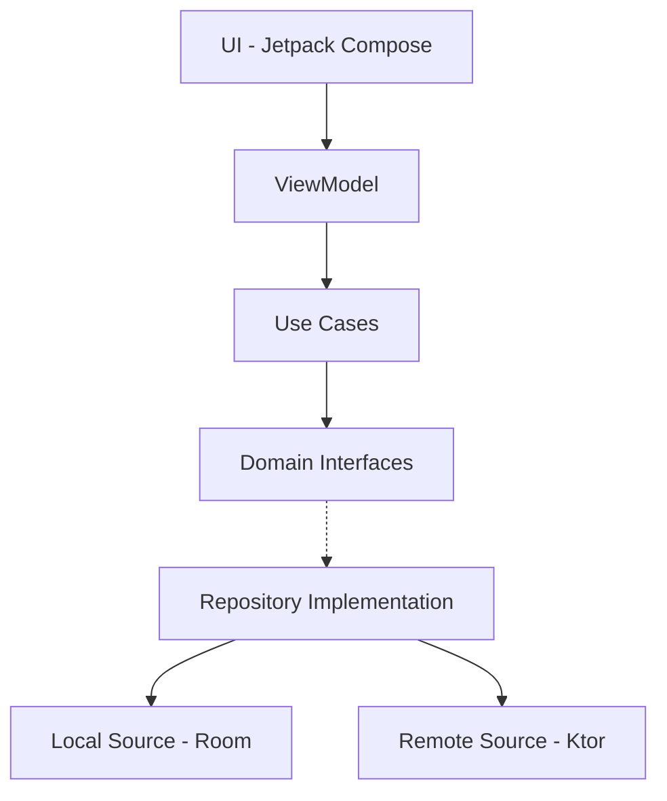

# OneWallet - Investment Portfolio Manager

OneWallet is a comprehensive Android application designed to manage and track investment portfolios. It allows users to monitor their assets (Stocks, Crypto, Funds, ETFs, and Cash) in real-time, visualize allocations, and analyze historical performance.

🌐 Languages:
- 🇬🇧 English (default)
- 🇪🇸 [Español](README.es.md)

## 🚀 Features

- **Multi-Asset & Multi-Currency**: Support for US Stocks, International Markets, Cryptocurrencies, Investment Funds, ETFs, and Bank Deposits. Assets can be added in any currency, and the app will automatically calculate and convert their value to your preferred base currency (EUR or USD) for a unified portfolio view.
- **Real-time Data**: Integration with multiple financial APIs (Finnhub, AlphaVantage, TwelveData, MarketStack) for up-to-date pricing.
- **Visual Analytics**: Interactive charts for asset allocation and monthly portfolio evolution.
- **Home Screen Widgets**: Stay updated with portfolio balance and market prices directly from your home screen. Widgets are automatically refreshed every hour using **WorkManager** to ensure data currency without excessive battery drain.
- **Smart Caching & Rate Limiting**: To respect API limitations and improve performance, I've implemented a custom caching layer. The app determines the "freshness" of data for each investment type; if the cached data is within the allowed time threshold, it is reused instead of making new API requests.
- **Privacy First**: All data is stored locally using Room database. No cloud sync, no tracking.
- **Privacy First (Shake to Hide & Blur)**: Built with user privacy in mind. By shaking the device, sensitive information such as balances and holdings is instantly hidden. On Android 12+ (API 31), a native **Gaussian blur effect** is applied to sensitive areas for a premium privacy experience.
- **Guided Onboarding**: Interactive in-app tutorial that guides users through every major component and functionality of the app.
- **Modern Edge-to-Edge**: Full support for Android 15+ edge-to-edge drawing, ensuring the UI seamlessly flows behind system bars for an immersive look.
- **Custom Telemetry**: Integrated a lightweight, private telemetry system via **Telegram API** for real-time error reporting without the need for heavy third-party SDKs like Firebase or Sentry.
- **Offline Support**: Cached data and manual asset entry for seamless use without internet.
- **Continuous Integration & Coverage**: Fully automated pipeline that compiles the app and executes the entire suite of unit tests on every push. It includes **JaCoCo** integration to generate detailed code coverage reports, ensuring high testing standards.
- **Git Hooks (Quality Gates)**: 
    - **Pre-commit**: Automatically runs **Detekt** on staged files to ensure code quality before every commit.
    - **Pre-push**: Runs a full static analysis check to prevent pushing code with smells or architectural violations.
- **Automated Hook Installation**: Git hooks are automatically installed/updated during the build process, ensuring all contributors follow the same quality standards.
- **Static Analysis (Detekt)**: Strict adherence to Kotlin standards using a custom configuration and a **Baseline system**, allowing the project to evolve without being blocked by legacy issues while ensuring all new code meets the highest quality bars.

## 🛠 Tech Stack & Architecture

This project is built following the highest standards of Android development, focusing on maintainability, testability, and performance.

### Architecture: Clean Architecture + MVI

The project is structured into three layers to ensure a clear separation of concerns, following a unidirectional dependency rule:
- **Domain Layer**: Pure Kotlin business logic, Use Cases, and Repository interfaces.
- **Data Layer**: Repository implementations, Room database, Ktor network clients, and Mappers.
- **Presentation Layer**: Jetpack Compose UI, ViewModels, and MVI (Model-View-Intent) for predictable state management.



### Libraries & Tools
- **UI**: Jetpack Compose (Material 3), **Compose Compiler Reports** for stability analysis.
- **Dependency Injection**: Koin (Android, WorkManager, Compose).
- **Asynchronous Work**: Kotlin Coroutines & Flow.
- **Networking**: Ktor Client (CIO engine, Content Negotiation, Logging).
- **Serialization**: Kotlinx Serialization.
- **Persistence**: Room Database (with KSP).
- **Architecture**: **Navigation 3** (the latest Jetpack Navigation evolution), ViewModel.
- **Background Tasks**: WorkManager.
- **Onboarding/Tutorials**: Coachmark (UnifyCoachmark).
- **Animations**: Lottie for splash and transitions.
- **Visuals**: Coil for asset icons, Material Icons Extended.
- **Widgets**: Jetpack Glance (Material 3 support).
- **Collections**: **Kotlinx Immutable Collections** for optimized Compose recomposition.
- **Testing**: JUnit 5 (Jupyter), MockK, Turbine (for Flow testing), and custom MainDispatcher extensions.
- **Code Coverage**: **JaCoCo** with custom exclusions for generated code and UI components.
- **Static Analysis**: **Detekt** with custom rules for Kotlin and Android.
- **Build System**: Gradle Kotlin DSL, Version Catalog (libs.versions.toml).
- **AI-Assisted Development**: Custom context files (`GEMINI.md`, `android-rules.md`) to leverage LLMs for faster, consistent, and architecturally-aligned development.

## 📊 Financial Data Challenges & Solutions

One of the biggest challenges in this project was finding reliable and free financial data sources. Most professional APIs for global markets, ETFs, and mutual funds are expensive or extremely restricted. I implemented a robust multi-source strategy to ensure the app remains functional:

### Data Source Strategy
- **Cryptocurrencies**: Native integration with **Binance API**, which provides real-time data for thousands of pairs without requiring an API key.
- **US Stocks**: Primary data from **Finnhub** (limit: 60 requests/min).
- **International Markets**: Extensive use of **Yahoo Finance** as the main source for global equities.
- **Mutual Funds & ETFs**: Since there are virtually no free APIs for these assets, I implemented custom solutions:
    - **Backend Interception**: Reverse-engineering public web requests from financial portals.
    - **HTML Scraping**: Fallback mechanism that extracts price data directly from asset detail pages when APIs fail.
- **Smart Fallback System**: The app is designed to try multiple providers sequentially if the primary source doesn't find a specific symbol or reaches its limit.

### Rate Limit Mitigation & Scalability
To bypass the strict limitations of free API tiers and ensure the app works for multiple users:
- **API Key Rotation**: I've integrated multiple API keys for the same providers.
- **Smart Distribution**: Keys are distributed across devices using a hashing algorithm based on the unique `ANDROID_ID`. This ensures that the total request load is distributed across different keys, preventing a single user from exhausting the global quota for others.
- **Local Caching**: Extensive use of Room database to cache prices and reduce unnecessary network calls.

## 🏗 Project Structure

```text
com.davidcrespo.onewallet
├── core             # Common composables, extensions, and base models
├── data             # Network clients, Database configuration, and Repository implementations
├── di               # Koin dependency injection modules
├── domain           # Business logic: Use Cases, Repository interfaces, and Domain models
└── presentation     # UI Layer: Screens, ViewModels, MVI Contracts, and Design System
```

## ⚙️ Configuration & API Keys

The project requires several API keys to fetch financial data. These are managed via `secrets.properties` in local environments and Environment Variables in CI.

### 1. Local Setup
Create a `secrets.properties` file in the root directory:
```properties
FINNHUB_API_KEY=your_key
ALPHA_VANTAGE_API_KEY=your_key
ALPHA_VANTAGE_API_KEY_2=your_key
ALPHA_VANTAGE_API_KEY_3=your_key
MARKETSTACK_API_KEY=your_key
MARKETSTACK_API_KEY_2=your_key
TWELVE_DATA_API_KEY=your_key
TELEGRAM_API_KEY=optional_key
TELEGRAM_CHAT_ID=optional_id
```

### 2. API Providers
- **Finnhub**: Used for US Stock data.
- **TwelveData**: Alternative for US Stock and Crypto data.
- **AlphaVantage**: Primary source for International Stocks and Funds.
- **MarketStack**: Secondary source for global markets.

*Note: Free tiers for these APIs have strict rate limits. The app handles these gracefully.*

## 🧪 Testing

The project includes a robust testing suite:
- **Unit Tests**: Coverage for Use Cases and ViewModels using MockK and Turbine.
- **Integration Tests**: Verification of data flow between layers.
- **UI Tests**: (In progress) Smoke tests for Compose components.

To run the tests:
```bash
./gradlew test
```

To run unit tests with coverage report (JaCoCo):
```bash
./gradlew testDebugUnitTestCoverage
```
The report will be generated at `app/build/reports/jacoco/testDebugUnitTestCoverage/html/index.html`.

## 🧪 DeteKt
To launch the **Detekt** analysis manually, you have several options depending on your needs:

1. **Full analysis (Whole app)**: Basic command that reviews all the code based on the configured rules.
```bash
./gradlew detekt
```

2. **Generate HTML report**: To see exactly which lines are failing with a friendly interface.
```bash
./gradlew detekt -Pdetekt.html.report=true
```
The report will be generated at `app/build/reports/detekt/detekt.html`.

3. **Update the Baseline**: If you want to "pardon" new failures or clean up the current list of errors.
```bash
./gradlew detektBaseline
```

4. **Auto-correction**: Only for basic style errors (like white spaces or imports).
```bash
./gradlew detekt --auto-correct
```

## 📈 Design Decisions & Professional Standards

- **MVI Pattern**: Chosen to ensure a single source of truth for the UI state, making it easier to debug and test complex screens like the Portfolio view.
- **Compose Stability & Performance**: 
    - Use of **Immutable Collections** to ensure UI components are marked as "Stable" by the Compose compiler, preventing unnecessary recompositions and ensuring 60fps performance on low-end devices.
    - Implementation of **State Hoisting** for cleaner, testable, and more reusable composables.
    - Strategic use of **remember** and **derivedStateOf** to minimize expensive calculations and recompositions.
    - Efficient list rendering using **unique keys** in `LazyColumn` and `LazyRow` to optimize item additions, removals, and reordering.
    - Adoption of **Immutable Data Classes** across the entire presentation layer to maintain state integrity and compiler stability.
    - Regular audits using **Compose Compiler Reports** to identify and fix unskippable composables.
- **Accessibility (A11y)**: Every UI component is designed with accessibility in mind, using proper semantics and `contentDescription` to support Screen Readers.
- **Modern Edge-to-Edge**: Native implementation of the latest Android drawing standards, handling window insets properly across all screens.
- **Internationalization (i18n)**: Full support for English and Spanish, with a structure ready for easy localization into further languages.
- **Resilient Error Handling**: Implemented a robust error management strategy using custom Result types and specific UI states to provide meaningful feedback to the user even during complex network failures or rate-limiting scenarios.
- **Ktor over Retrofit**: Used for its multiplatform potential and more modern DSL-based configuration.
- **Glance for Widgets**: Leverages Compose-like syntax to build app widgets, ensuring UI consistency across the entire system.
- **Manual vs Market Assets**: The system distinguishes between assets with automatic pricing (Stocks/Crypto) and manual entries (Bank/Other), providing a unified balance calculation through a specialized Use Case.
